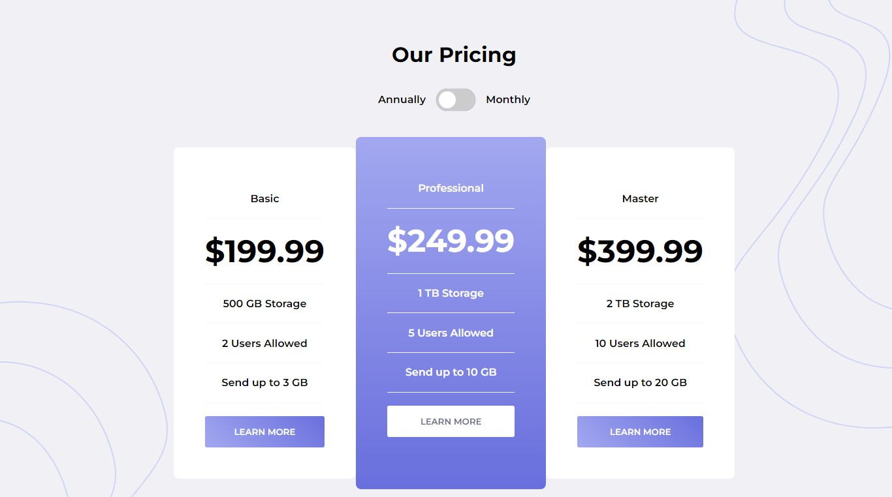

# Frontend Mentor - Pricing component with toggle solution

This is a solution to the [Pricing component with toggle challenge on Frontend Mentor](https://www.frontendmentor.io/challenges/pricing-component-with-toggle-8vPwRMIC). 

## Table of contents

- [Overview](#overview)
  - [The challenge](#the-challenge)
  - [Screenshot](#screenshot)
  - [Links](#links)
- [My process](#my-process)
  - [Built with](#built-with)
  - [What I learned](#what-i-learned)
- [Author](#author)


**Note: Delete this note and update the table of contents based on what sections you keep.**

## Overview

### The challenge

Users should be able to:

- View the optimal layout for the component depending on their device's screen size
- Control the toggle with both their mouse/trackpad and their keyboard
- **Bonus**: Complete the challenge with just HTML and CSS

### Screenshot




### Links

- Live Site URL: [Pricing Component](https://pricing-component-o.netlify.app)

## My process

### Built with

- Semantic HTML5 markup
- CSS custom properties
- Flexbox
- Mobile-first workflow


### What I learned

- Customizing CSS checkbox
- Linear gradient

```css

input:checked+.slider {
    background-color: hsl(237, 63%, 64%);
}

input:focus+.slider {
    box-shadow: 0 0 1px hsl(237, 63%, 64%);
}

input:checked+.slider:before {
    -webkit-transform: translateX(26px);
    -ms-transform: translateX(26px);
    transform: translateX(26px);
}

.pricing--card button {
  background: linear-gradient(45deg, hsl(236, 72%, 79%), hsl(237, 63%, 64%));
}
```


## Author
- Frontend Mentor - [@Master-Osaro](https://www.frontendmentor.io/profile/yourusername)
- Twitter - [@iyoha_osaro](https://www.twitter.com/yourusername)
